# Remove Unity Splash Screen

## Introduction


Are you a Unity Developer? Did you hate this logo appears in your games? Bother? Didn't have money to buy the license?
Well, me too...  
So, I will share to you how to remove Unity splash screen for free without any license $hit!

I haven't tried on some platforms because I haven't installed the dependencies needed to build games on those platforms in Unity, maybe I'll try them in the future.
But, if you manage to remove the Unity splash screen using the method below, please make a [Pull Request](https://github.com/kiraio-moe/remove-unity-splash-screen "Pull Request") or contact me on [my social media](https://github.com/kiraio-moe) and let me know the details so I can get it straight away updating this thread.

Without further ado, let's do it!

## Prerequisite

Install the following tools before proceed to [Step-by-step section](#step-by-step):

### General (Required)

- [Unity Asset Bundle Extractor (UABE)](https://github.com/SeriousCache/UABE/releases "Unity Asset Bundle Extractor")
- [HxD Hex Editor](https://mh-nexus.de/en/hxd/ "HxD Hex Editor")

### Platform Specific

Install the following tools if you wanna work with another platform:

#### Android

- [APKTool GUI](https://github.com/AndnixSH/APKToolGUI/releases "APKTool GUI")

#### WebGL

- [PeaZip](https://peazip.github.io/ "PeaZip") (Optional)

## Step-by-step

I don't know how games built with IL2CPP looks like on PC platforms. If you don't mind, please create a dummy project and build with IL2CPP scripting backend and send the build to me via email: <itsyuukunz@gmail.com>. I'll try playing with it ;)

### PC (Mono)

- Prepare your game that has been built.

  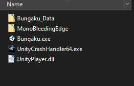

- Go to the `Game Title_Data` folder and **backup** the `globalgamemanagers` file in case of errors.
- Open the `globalgamemanagers` file using Unity Asset Bundle Extractor (UABE).
- Click `globalgamemanagers (Assets)` in Files and Components. Select `Unnamed asset` which is of type **`PlayerSettings`** then click **View Data** and...

  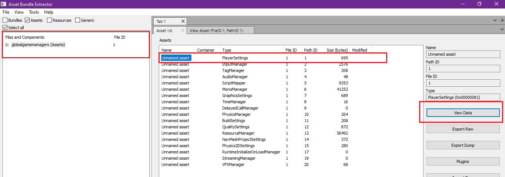

- BOOM! Error................

  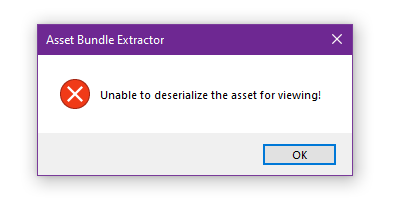

  > Need corrections probably. Because one day, I tried to open the PlayerSettings of a game made using Unity 2018 but I can't access it.

  This happens in games using Unity version >= 2020 where it seems Unity has encrypted (probably) the **PlayerSettings** part but not the other part. Whereas when I try to open the **PlayerSettings** section of the game built using Unity 2019, UABE can still access it.

- We will fix the problems in the Unity 2020 version later. For now, let's focus on games built using Unity <= 2019.  
  As you can see, we can access PlayerSettings. If we change the value of `m_ShowUnitySplashScreen` to `false` (by double clicking) then the Splash Screen will not appear when starting the game (the **Made with Unity** logo will also not appear automatically) and as you can guess, if we change the value of `m_ShowUnitySplashLogo` to `false` then the **Made with Unity** logo will not appear.

  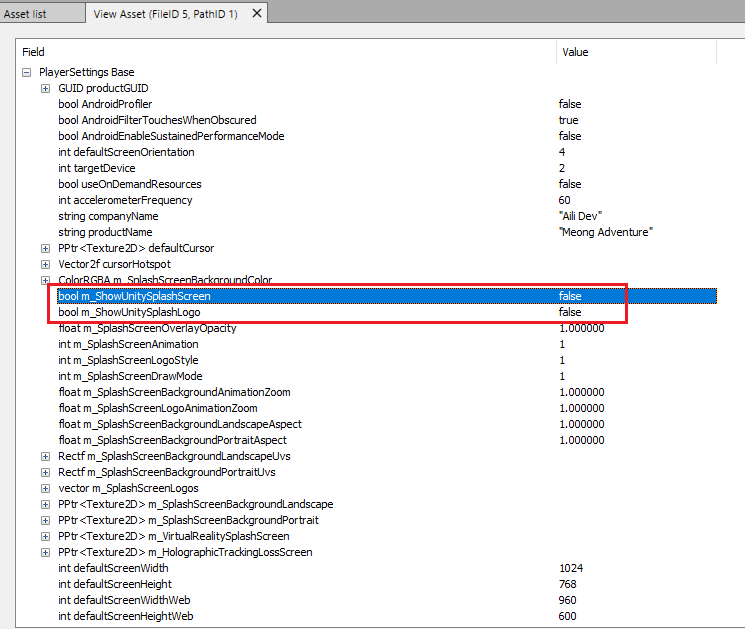

  But, by just removing the **Made with Unity** logo will not work if the **Made with Unity** splash logo is still listed in `m_SplashScreenLogos`. To fix this, we can simply delete the array item that contains the **Made with Unity** logo. Great!

  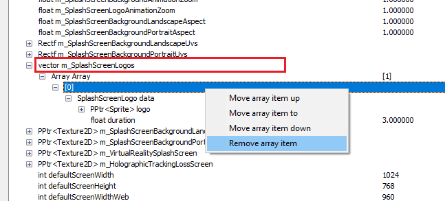

<span id="img-enable-pro-version"></span>

- Now let's move on to other settings. Move to **Asset List** and open `BuildSettings`:

  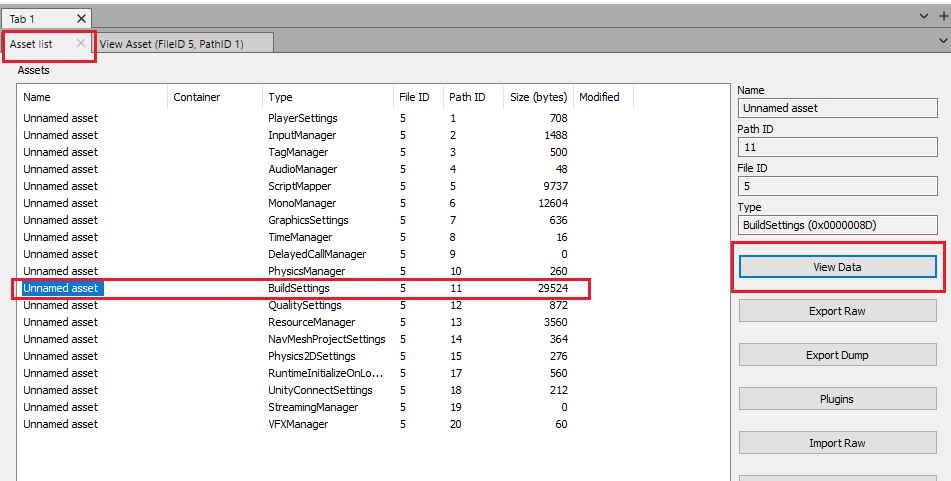

- Select `hasPROVersion` and change the value to `true`:

  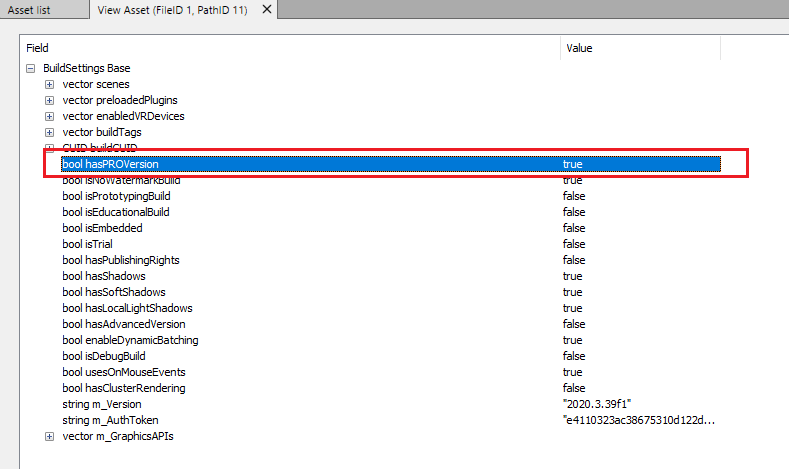

- Save your changes (IDK why **Apply** does nothing). UABE cannot overwrite the file that being edited, so just save it as `globalgamemanagers-mod`.

  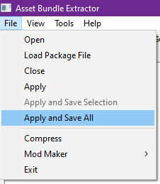

- Close `globalgamemanagers` on UABE or simply close UABE app, delete the original `globalgamemanagers` file (Remember! you have a backup, don't worry...) and rename `globalgamemanagers-mod` to `globalgamemanagers`.
- Try running the game and be surprised!

#### Fix for Unity >= 2020

If you've read all the steps above, you should know what the problem is, UABE can't deserialize PlayerSettings on Unity >= 2020 because it's encrypted (probably). That's why the Hex Editor is coming for! Make sure you meet the [prerequisite](#prerequisite)!

- Open `globalgamemanagers` file using HxD.
- Search your **Company Name** or **Product Name** (in my case it's `kiraio` and `Bungaku`) until you get like the image below.  
  Notice the **first Question Mark (?)** after the product name, right after that there's a hex value `01 01` (in my case, it's in offset: 1060 and 1061). If you change the hex value of the first `01` to `00` then the Splash Screen will be disabled, while the following `01` sets whether the **Made with Unity** logo will appear or not.

  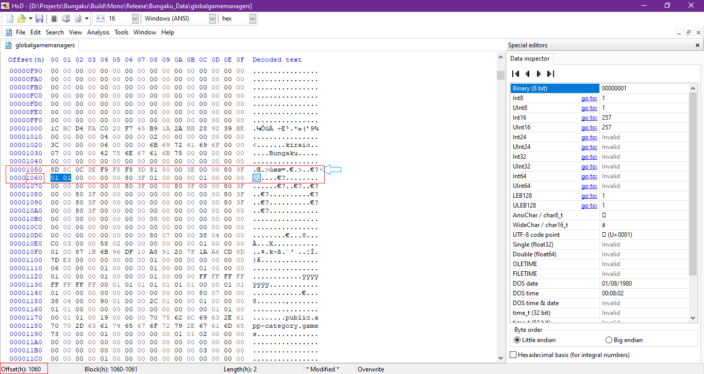

- Boolean Splash Screen (`m_ShowUnitySplashScreen`) was discovered by the YouTube channel **Awesomegamergame** in his video <https://www.youtube.com/watch?v=xvh0AeZCX9E>. But the way he just change the Splash Screen boolean value to false doesn't work in other versions of Unity. I think this thread as a complement to the tutorial.
- After changing the Splash Screen boolean, now change the `m_hasPROVersion` boolean exactly like [the method above](#img-enable-pro-version).

### Android (Mono, IL2CPP)

- Prepare your Unity Android game.

  > In the image, I used the `.apks` format which is basically just a `.zip` file, so I just extracted it and got 2 files namely `base.apk` and `split_config.arm64_v8a.apk`. After I finished doing the step below, I archived files again to `.zip` and changed the name of the extension to `.apks`.

  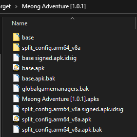

- Open APKToolGUI (Make sure you meet [APKToolGUI requirements](https://github.com/AndnixSH/APKToolGUI#requirements "APKToolGUI requirements")).  
  Drag and Drop the APK file (If you using ``.apks`` file, just drop which you guys think is the main APK, in my case is `base.apk`) to the APK File section. APKToolGUI will automatically decompile the APK.

  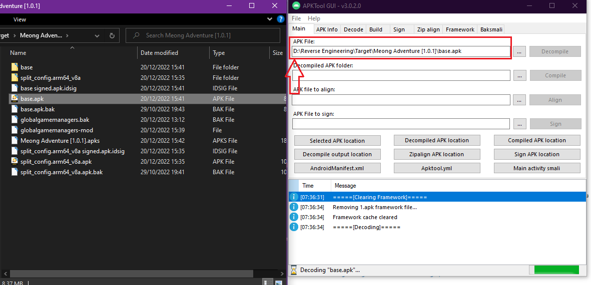

- Go to the decompiled APK folder then go to `assets/bin/Data` folder, you will find the `globalgamemanagers` file.

  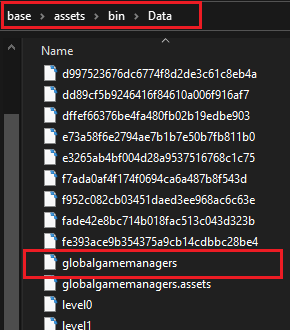

- **Do the same as in [PC (Mono) section](#pc-mono "PC (Mono) section")**.
- After finish editing `globalgamemanagers`, go to APKToolGUI and re-compile the decompiled APK folder.

  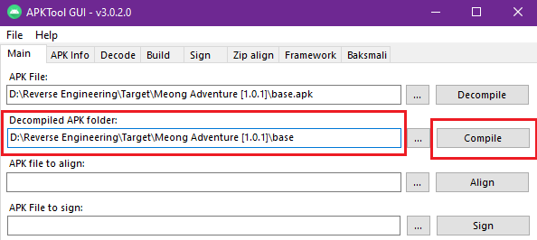

- DONE!
- For those who have uploaded the game to the App Store (such as Google Play), make sure to sign your APK consistently. If not, when you update your game that is already installed on Android, an error `Signature is inconsistent with an existing application` will appear. For new apps, it might be time for you to start signing APKs consistently.

  > You can generate a Keystore in Unity, go to `Project Settings > Publishing Settings > Manage Keystore` (Make sure you have switched to Android platform).

  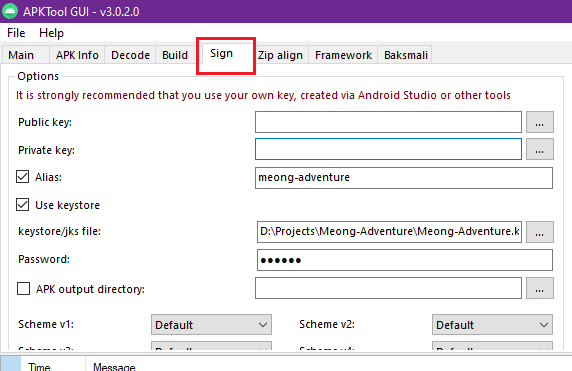

### WebGL (Mono, IL2CPP)

I thought I would give up on the WebGL build because I think the `globalgamemanagers` file was in `WebGL.wasm` file which is currently there's no good tool to decompile Web Assembly.  
But after digging deeper, I found a hint that the `globalgamemanagers` file is in the `WebGL.data` file, in the end I was able to remove the Unity splash screen in the WebGL build :)

- Prepare your Unity WebGL game, then go to `Build` folder.

  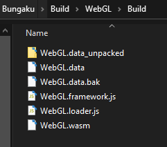

- If you build using Brotli (`.br`) or Gzip (`.gzip`) compression, you can install [PeaZip](https://peazip.github.io/ "PeaZip") or any archiving tool to extract `WebGL.data.br` or `WebGL.data.gzip` and get the `WebGL.data` file. After removing the splash screen, you can archive it back into original extension.

  > Did you know? You can unpack the content of `WebGL.data` file using [Asset Studio](https://github.com/Perfare/AssetStudio/releases "Asset Studio"), there you will get this:
  >
  > 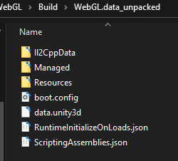
  >
  > The `globalgamemanagers` file is inside `data.unity3d` file. I tried to open it in UABE but UABE unable to open it. If you know how to unpack and repack `data.unity3d` file, let me know!  
  >
  > Even I can unpack `WebGL.data`, still I didn't know how to repack it back :(

- With all the limitations above, there is no other way but to edit the `WebGL.data` file directly. Open the `WebGL.data` file using HxD (Don't forget to backup the original file!).
- Search your **Company Name** or any of string I highlighted below. Until you get like this.

  

- This time, boolean ``m_ShowUnitySplashScreen`` isn't after the first question mark that appear after the **Product Name**, but after the **Double Quote** (**"**). Change the hex value (in my case, it's offset: 59CEF7) to ``00`` to disable the splash screen.

  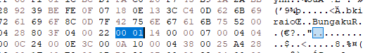

- Now, we need to search where boolean ``hasPROVersion`` located. This is the trickiest part...  
  I found a hint to search the boolean using the first 40 characters (from the front) of ``m_AuthToken``.

  ```txt
  077fc7b716f3938b594d7ec67f4107f3e125c97d
  ```

  I got it from the ``globalgamemanagers`` file of my game that was built on another platform. You can copy and start looking for that string in HxD. ``m_AuthToken`` may be different, but as far as I can find, other games also have the same identifier as me.

  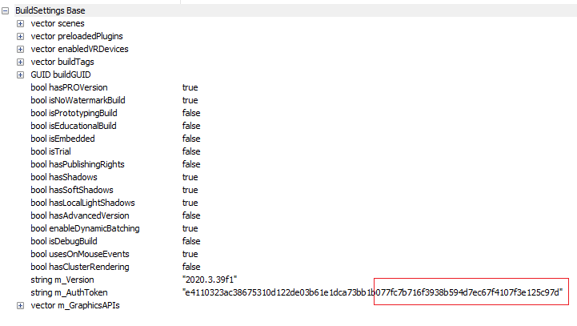

- I tried reverse every hex that has ``00`` or ``01`` value before the string we are looking for.  
  Finally I found it! The second hex (red) which has a value of ``01`` (I have changed it to ``00`` in the picture) is the boolean ``hasPROVersion``.
  > I'm confused why ``00`` which should be ``false`` becomes ``true`` and vice versa.

  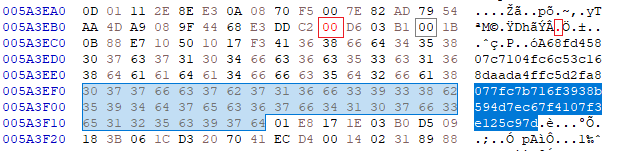

- Save & DONE!

## Notes

- There is no difference affecting the splash screen in the `globalgamemanagers` file between Development builds and Release builds.
- Yep, that's my Android game I used as a test subject. You can see find it at [Google Play Store](https://play.google.com/store/apps/details?id=aili.dev.meongadventure&hl=id&gl=US&pli=1 "Meong Adventure on Google Play Store") XD (Pssttt... a remake is in the works).

## Result


Tested and work on games built with the following versions of Unity:

### Unity 2020.3.39.26224 (LTS)

- PC/Windows x86_64 (Mono)
- Android (Mono, IL2CPP)
- WebGL (Mono, IL2CPP)

### Unity 2019.4.12f1 (LTS)

- Android (Mono, IL2CPP)

Worked? Please, give it a star ⭐ and tell everyone on [Pull Request](https://github.com/kiraio-moe/remove-unity-splash-screen/pulls "Pull Request").  
Something is missing? Misinformation? Make an [Issue](https://github.com/kiraio-moe/remove-unity-splash-screen/issues "Issue").

## Huge Thanks

Many thanks to this fellas:

- [SeriousCache](https://github.com/SeriousCache "SeriousCache") for [Unity Asset Bundle Extractor (UABE)](https://github.com/SeriousCache/UABE "Unity Asset Bundle Extractor")
- Maël Hörz for [HxD Hex Editor](https://mh-nexus.de/en/hxd/ "HxD Hex Editor")
- [iBotPeaches](https://github.com/ibotpeaches "iBotPeaches") for [Apktool CLI](https://ibotpeaches.github.io/Apktool/ "Apktool CLI")
- [INF1NUM](https://github.com/INF1NUM "INF1NUM") | [AndnixSH](https://github.com/AndnixSH "AndnixSH") for [APKToolGUI](https://github.com/AndnixSH/APKToolGUI "APKToolGUI")
- [Awesomegamergame](https://www.youtube.com/@Awesomegamergame "Awesomegamergame YouTube channel") for [discovering splash screen offset](https://www.youtube.com/watch?v=xvh0AeZCX9E)
- and others that I didn't mention...

## Disclaimer

By doing this, of course you violate the applicable terms of Unity. #DWYOR!
