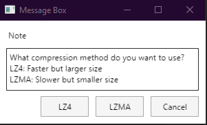

# Remove Unity Splash Screen

## Introduction


> Well, pretty damn controversial.., huh?

Are you a Unity Developer? Did you bother this logo appear in your game? Didn't have much money to buy the license?
No worry, I will share to you how to remove Unity splash screen for free without any license $hit!

I haven't tried on some platforms because I haven't installed the dependencies needed to build games on those platforms in Unity.
But, if you manage to remove the Unity splash screen using the method below, please make an [Issue](https://github.com/kiraio-moe/remove-unity-splash-screen/issues "Issue") or contact me through [my social media](https://github.com/kiraio-moe) and let me know the details so I can get it straight away updating this thread.

Without further ado, let's do it!

## Table of Contents

- [Disclaimer](#disclaimer "Disclaimer")
- [Prerequisites](#prerequisites "Prerequisites")
  - [General (Required)](#general-required "General (Required)")
  - [Platform Specific](#platform-specific "Platform Specific")
- [Step-by-step](#step-by-step "Step-by-step")
  - [Universal](#universal "Universal")
    - [data.unity3d](#dataunity3d "data.unity3d")
    - [unity default resources](#unity-default-resources "unity default resources")
  - [PC, Mac, Linux Standalone](#pc-mac-linux-standalone "PC, Mac, Linux Standalone")
    - [Fix for Unsupported Version](#fix-for-unsupported-version "Fix for Unsupported Version")
  - [Android](#android "Android")
    - [Alternative: data.unity3d](#alternative-dataunity3d "Alternative: data.unity3d")
  - [WebGL](#webgl "WebGL")
- [Notes](#notes "Notes")
- [Result](#result "Result")
- [Credits](#huge-thanks "Credits")

## Disclaimer

By doing this, of course you violate the applicable terms of Unity Technologies. #DWYOR!

## Prerequisites

Install the following tools before proceed to [Step-by-step](#step-by-step) section:

### General (Required)

- [Unity Asset Bundle Extractor (UABE)](https://github.com/SeriousCache/UABE/releases "Visit Unity Asset Bundle Extractor GitHub repo")
- [Unity Asset Bundle Extractor Avalonia (UABEA)](https://github.com/nesrak1/UABEA/releases "Unity Asset Bundle Extractor Avalonia (UABEA) GitHub repo")
- [HxD Hex Editor](https://mh-nexus.de/en/hxd/ "Visit HxD Hex Editor website")

### Platform Specific

Install the following tools if you wanna work with another platform:

- Android
  - [APKTool GUI](https://github.com/AndnixSH/APKToolGUI/releases "APKTool GUI")
- WebGL
  - [PeaZip](https://peazip.github.io/ "PeaZip") (Optional)

## Step-by-step

Before doing the actual work, don't forget to always backup the original files.

If you build a new game with different Project Settings, you need to remove the splash screen again to avoid any errors. Don't just replacing using the old modded `globalgamemanagers` or `data.unity3d` file.

You may want to read [PC, Mac, Linux Standalone](#pc-mac-linux-standalone) section first and the rest to know the context then read the [Universal](#universal "Universal") section.

### Universal

#### data.unity3d

Unity will use `globalgamemanagers` file directly in your game if you choose the Compression Method to Default. While LZ4 & LZ4HC, Unity will pack/compress `globalgamemanagers` file and other resources file into `data.unity3d` file. So, removing Unity splash screen will be much more easy if we can get `globalgamemanagers` directly.


Sadly, if I try to open `data.unity3d` file using UABE, UABE can't open it.


But, with this great fork of UABE, UABE Avalonia can read `data.unity3d` file seamlessly. UABEA is similiar with UABE, but the downfall of it is that UABEA didn't support editing like UABE. That's ok, we can edit it with external tools. Okay, let's remove the splash screen.

- Open `data.unity3d` file using UABEA. If UABEA prompting to decompress the data to File or in Memory, I prefer to Memory.
- Choose `globalgamemanagers` then Export. Save it as `globalgamemanagers-mod` (or whatever name you want).

  

- Start editing `globalgamemanagers-mod` either using UABE or HxD. How to do it? Read [PC, Mac, Linux Standalone](#pc-mac-linux-standalone "Go to PC, Mac, Linux Standalone") section.
- After removing the splash screen in `globalgamemanagers-mod`, back to UABEA. Still choosing `globalgamemanagers`, Import `globalgamemanagers-mod`, it will replacing the original `globalgamemanagers` from `data.unity3d`.
- You're done! Save it as `data-mod.unity3d`. Move or rename original `data.unity3d` to `data-original.unity3d`, then rename `data-mod.unity3d` to `data.unity3d`.
- `data.unity3d` file size produced by UABEA is much more larger than the original file, you can compress that. Open modded `data.unity3d` in UABEA, then go to File > Compress. Choose either LZ4 or LZMA (LZ4HC), it's up to you.

  

#### unity default resources

This is the easiest way to remove Unity splash screen. You just need to edit `unity default resources` file in your build.  
PC: `GameTitle_Data/Resources/`.  
Android: `assets/bin/Data/`. Steps for decompile & recompile APK file, please refer to [Android](#android) section.  

- Open `unity default resources` file using UABE.
- Search for `UnitySplash-cube` which is type of Texture2D then view the data.

  

- Set the `m_Width` and `m_Height` variable to `0` by double click it.

  

- Don't forget to set the `Draw Mode` to `All Sequential` and Unity logo duration to 2 second, Player will not notice that blank Made with Unity splash. If the `Draw Mode` is `Unity Logo Below`, it will resulting in a weird splash screen where your logo isn't in center but on top.

  

- DONE! Save then replace original `unity default resources` file.

### PC, Mac, Linux Standalone

<div align="center">
  <a href="https://www.youtube.com/watch?v=05ymbWXdZ-8" title="Watch YouTube video" target="_top">
    
  </a>
  <br>
  <sub>Watch YouTube video</sub>
</div>

- Prepare your game that has been built.

  

- Go to the `Game Title_Data` folder and **backup** the `globalgamemanagers` file in case of errors.
- Open the `globalgamemanagers` file using Unity Asset Bundle Extractor (UABE).
- Click `globalgamemanagers (Assets)` in Files and Components. Select `Unnamed asset` which is of type **`PlayerSettings`** then click **View Data** and...

  

- BOOM! Error................

  

  This happens because UABE didn't support parsing those particular data.

- We will fix that problem later. For now, let's see how to work with UABE if your Unity version is fully supported by UABE.  
  As you can see, we can access PlayerSettings. If we change the value of `m_ShowUnitySplashScreen` to `false` (by double clicking) then the entire Splash Screen will not appear when starting the game (the **Made with Unity** logo will also not appear automatically) and as you can guess, if we change the value of `m_ShowUnitySplashLogo` to `false` then the **Made with Unity** logo will not appear.

  

  But, by just removing the **Made with Unity** logo will not work if the **Made with Unity** splash logo is still listed in `m_SplashScreenLogos`. To fix this, we can simply delete the array item that contains the **Made with Unity** logo. Great!

  > Not tested though. But, it's a great way to ensure that we completely remove the logo.

  

- Now let's move on to other settings. Move to **Asset List** tab and open `BuildSettings`:

  

- Select `hasPROVersion` and change the value to `true`:

  

- Save your changes (IDK why **Apply** does nothing). UABE cannot overwrite the file that being edited, so just save it as `globalgamemanagers-mod`.

  

- Close `globalgamemanagers` on UABE or simply close UABE app, delete the original `globalgamemanagers` file or rename to something else then rename `globalgamemanagers-mod` to `globalgamemanagers`.
- Try running the game and be surprised!

#### Fix for Unsupported Version

If you've read all the steps above, you should know what the problem is. UABE can't deserialize some or entire data of ``globalgamemanagers``. That's why the Hex Editor is coming for! We will edit boolean ``m_ShowUnitySplashScreen`` and ``hasPROVersion`` manually using HxD.

- Open `globalgamemanagers` file using HxD.
- First, we remove the splash screen. Search your **Company Name** or **Product Name** (in my case it's `kiraio` and `Bungaku`) until you get like the image below.  
  Notice the **first Question Mark (?)** after the product name, right after that there's a hex value `01 01` (in my case, it's in offset: 1060 and 1061). If you change the hex value of the first `01` to `00` then the Splash Screen will be disabled, while the following `01` sets whether the **Made with Unity** logo will appear or not.

  

- Now we need to switch the ``hasPROVersion`` boolean to ``true``. Search the name of a scene that you included in the build or your Unity version until you get like the image below. The highlighted hex value (offset: E7A4, 20 offset before the Unity version) is the boolean ``hasPROVersion``. Change to ``01`` value to enable it.

  

- Boolean Unity splash screen (`m_ShowUnitySplashScreen`) was discovered by the YouTube channel **Awesomegamergame** in his video <https://www.youtube.com/watch?v=xvh0AeZCX9E>. But the way he just change the Unity splash screen boolean value to false doesn't work in other versions of Unity. I think this thread as a complement to his tutorial.

### Android

<div align="center">
  <a href="https://www.youtube.com/watch?v=LlXiXN3IngI" title="Watch YouTube video" target="_top">
    
  </a>
  <br>
  <sub>Watch YouTube video</sub>
</div>

- Prepare your Unity Android game.

  > In the image, I used the `.apks` format which is basically just a `.zip` file, so I just extracted it and got 2 files namely `base.apk` and `split_config.arm64_v8a.apk`. After I finished doing the step below, I archived files again to `.zip` and changed the name of the extension to `.apks`.

  

- Open APKToolGUI (Make sure you meet [APKToolGUI requirements](https://github.com/AndnixSH/APKToolGUI#requirements "APKToolGUI requirements")).  
  Drag and Drop the APK file (If you using ``.apks`` file, just drop which you guys think is the main APK, in my case is `base.apk`) to the APK File section. APKToolGUI will automatically decompile the APK.

  

- Go to the decompiled APK folder then go to `assets/bin/Data` folder, you will find the `globalgamemanagers` file.

  

- Do the same as in [PC, Mac, Linux Standalone section](#pc-mac-linux-standalone "PC, Mac, Linux Standalone section").
- After finish editing `globalgamemanagers`, go to APKToolGUI and re-compile the decompiled APK folder.

  

- DONE!
- For those who have uploaded the game to the App Store (such as Google Play), make sure to sign your APK consistently. If not, when you update your game that is already installed on Android, an error `Signature is inconsistent with an existing application` will appear.

  > Not fully tested!

  For new apps, it might be time for you to start signing APKs consistently.

  > You can generate a Keystore in Unity, go to `Project Settings > Publishing Settings > Manage Keystore` (Make sure you have switched to Android platform).

  

### Alternative: data.unity3d

> If you want an easiest way, please go to [Universal: data.unity3d](#dataunity3d) section.

I just discovered that my Unity Android game is using ``data.unity3d`` file to store the ``globalgamemanagers`` file like in [WebGL](#webgl "WebGL"):


The steps to remove the splash screen is same as before. The boolean ``m_ShowUnitySplashScreen`` is same after the first question mark:


While boolean ``hasPROVersion`` is slightly different with ``globalgamemanagers`` in [PC, Mac, Linux Standalone](#pc-mac-linux-standalone "PC, Mac, Linux Standalone").  
12 offset before the 'cutted' Unity version:


### WebGL

<div align="center">
  <a href="https://www.youtube.com/watch?v=ktkaAFYpJzA" title="Watch YouTube video" target="_top">
    
  </a>
  <br>
  <sub>Watch YouTube video</sub>
</div>

I thought I would give up on the WebGL build because I think the `globalgamemanagers` file was in `WebGL.wasm` file which is currently there's no good tool to decompile Web Assembly.  
But after digging deeper, I found a hint that the `globalgamemanagers` file is in the `WebGL.data` file, in the end I was able to remove the Unity splash screen in the WebGL build :)

- Prepare your Unity WebGL game, then go to `Build` folder.

  

- If you build using Brotli (`.br`) or Gzip (`.gzip`) compression, you can install [PeaZip](https://peazip.github.io/ "PeaZip") or any archiving tool to extract `WebGL.data.br` or `WebGL.data.gzip` and get the `WebGL.data` file. After removing the splash screen, you can archive it back into the original extension.

  > Did you know? You can unpack the content of `WebGL.data` file using [Asset Studio](https://github.com/Perfare/AssetStudio/releases "Asset Studio"), there you will get this:
  >
  > 
  >
  > The `globalgamemanagers` file is inside `data.unity3d` file. I tried to open it in UABE but UABE unable to open it. If you know how to unpack and repack `data.unity3d` file, let me know!  
  >
  > Even I can unpack `WebGL.data`, still I didn't know how to repack it back :(

- With all the limitations above, there is no other way but to edit the `WebGL.data` file directly. Open the `WebGL.data` file using HxD (Don't forget to backup the original file!).
- Search your **Company Name** or any of string I highlighted below:

  

- This time, boolean ``m_ShowUnitySplashScreen`` isn't after the first question mark that appear after the **Product Name**, but after the **Double Quote (")**. Change the hex value (in my case, it's offset: 59CEF7) to ``00`` to disable the splash screen.

  

  > If you change the following highlighted hex value: ``01`` to ``00``, will resulting in some sort of Active Input Handler error. So, don't do that!

- Now, we need to search where boolean ``hasPROVersion`` located. This is the trickiest part...  
  I found a hint to search the boolean using the first 40 characters (from the front) of ``m_AuthToken`` string.

  ```txt
  077fc7b716f3938b594d7ec67f4107f3e125c97d
  ```

  I got it from the ``globalgamemanagers`` file of my game that was built on another platform.

  

  ``m_AuthToken`` is different for every installed machine. So, you need to build your game into another platform first. If you dilligent enough, you can manually search the string from offset ``5A3E00`` to offset ``5A4000`` or use the string I highlighted below:

  

- I tried reversing every hex that has ``00`` or ``01`` value before the string we are looking for.  
  Finally, I found it! The red highlighted hex (offset: 5A3EBA) which has a value of ``01`` (I have changed it to ``00`` in the picture) is the boolean ``hasPROVersion``, while the black highlighted hex (offset: 5A3EBE) is the boolean ``isDebugBuild``.
  > I'm confused why ``00`` which should be ``false`` becomes ``true`` and vice versa.

  

- Save & DONE!

## Notes

- If you choose Compresssion Method in Build Settings to Default, Unity will use `globalgamemanagers` directly without packing it into `data.unity3d` file. So, it will be much easier to remove the splash screen.
- No difference between Development build and Release build.
- No difference either Mono/IL2CPP scripting backend.

## Result

- **Android**

  

- **PC**

  

- **WebGL**

  

Tested and work on games built with the following versions of Unity:

- Unity 2021.3.39f1
  - Android ([#2][i2])
- Unity 2020.3.39f1
  - PC, Mac, Linux Standalone
  - Android
  - WebGL
- Unity 2019.4.12f1
  - PC, Mac, Linux Standalone
  - Android
  - WebGL

## Contribute

Worked? Please, give it a star ⭐ and tell everyone by making an [Issue](https://github.com/kiraio-moe/remove-unity-splash-screen/issues "Issue").  
Have a trouble? Make an [Issue](https://github.com/kiraio-moe/remove-unity-splash-screen/issues "Issue").  
Have another way in mind? Make a [Pull Request](https://github.com/kiraio-moe/remove-unity-splash-screen/pulls "Pull Request").

## Huge Thanks

Many thanks to this fellas:

- [SeriousCache](https://github.com/SeriousCache "Visit SeriousCache GitHub profile") for [Unity Asset Bundle Extractor (UABE)](https://github.com/SeriousCache/UABE "Visit Unity Asset Bundle Extractor (UABE) GitHub repo")
- [nesrak1](https://github.com/nesrak1 "Visit nesrak1 GitHub profile") for [Unity Asset Bundle Extractor Avalonia](https://github.com/nesrak1/UABEA "Visit Unity Asset Bundle Extractor Avalonia (UABEA) GitHub repo")
- Maël Hörz for [HxD Hex Editor](https://mh-nexus.de/en/hxd/ "Visit HxD Hex Editor website")
- [iBotPeaches](https://github.com/ibotpeaches "Visit iBotPeaches GitHub profile") for [Apktool CLI](https://ibotpeaches.github.io/Apktool/ "Visit Apktool CLI website")
- [INF1NUM](https://github.com/INF1NUM "Visit INF1NUM gitHub profile") | [AndnixSH](https://github.com/AndnixSH "Visit AndnixSH GitHub profile") for [APKToolGUI](https://github.com/AndnixSH/APKToolGUI "Visit APKToolGUI GitHub repo")
- [Awesomegamergame](https://www.youtube.com/@Awesomegamergame "Visit Awesomegamergame YouTube channel") for [discovering splash screen offset](https://www.youtube.com/watch?v=xvh0AeZCX9E "Watch How to remove Unity splash screen (forever) on YouTube")
- and others I didn't mention...

[i2]: https://github.com/kiraio-moe/remove-unity-splash-screen/issues/2
